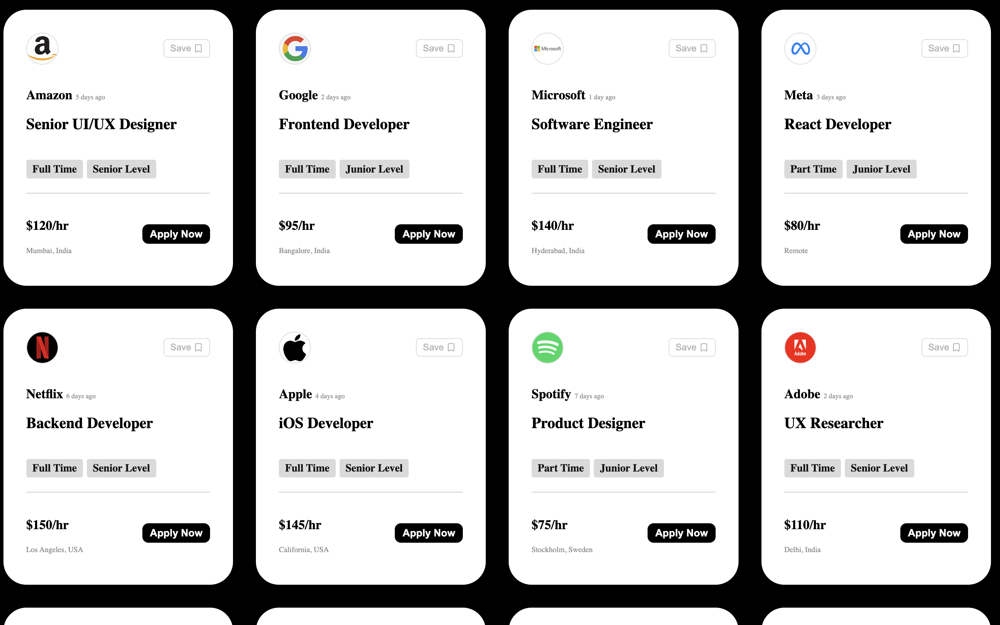

# Job Vacancy Mini Project

A modern job vacancy web application built with React.js and Vite.

## Features

- Job vacancy cards
- Company logos
- Salary information
- Location details
- Responsive design

## Screenshot



## Technologies Used

- React.js
- Vite
- CSS3
- JavaScript

## Installation

```bash
npm install
npm run dev
```

## License

MIT License
